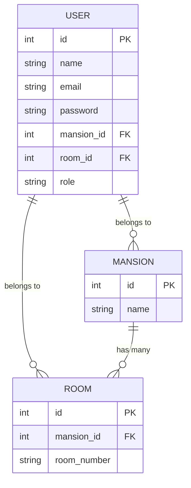

```mermaid
erDiagram
    USER {
        int id PK
        string name
        string email
        string password
        int mansion_id FK
        int room_id FK
        string role
    }
    MANSION {
        int id PK
        string name
    }
    ROOM {
        int id PK
        int mansion_id FK
        string room_number
    }
    USER ||--o{ MANSION: "belongs to"
    USER ||--o{ ROOM: "belongs to"
    MANSION ||--o{ ROOM: "has many"
```
