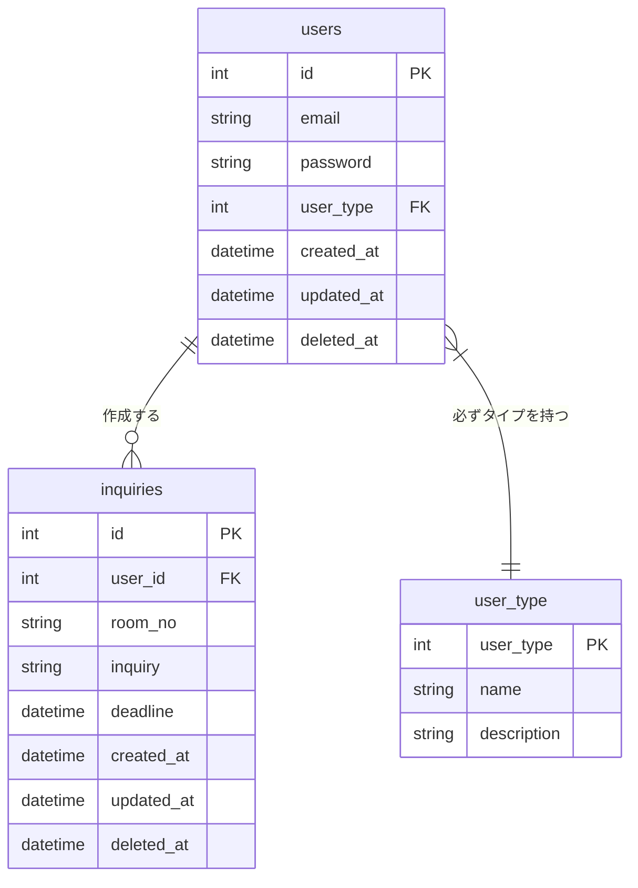

<!-- mermaid記法によるER図 -->

```mermaid
erDiagram

users ||--o{ inquiries : "作成する"
users }|--|| user_type : "必ずタイプを持つ"

users {
    int id PK
    string email
    string  password
    int user_type FK
    datetime created_at
    datetime updated_at
    datetime deleted_at
}

user_type {
    int user_type PK
    string name
    string description
}

inquiries {
    int id PK
    int user_id FK
    string room_no
    string inquiry
    datetime deadline
    datetime created_at
    datetime updated_at
    datetime deleted_at
}
```
