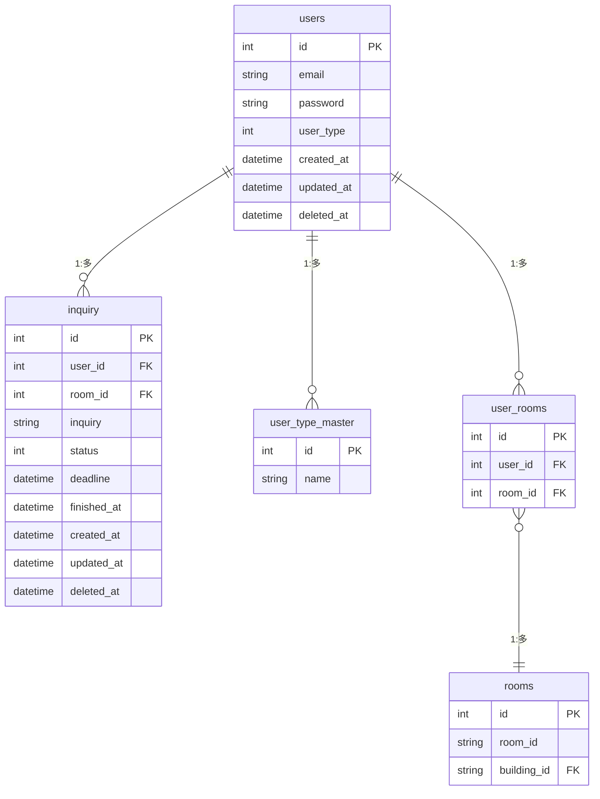

<!-- mermaid記法によるER図 -->

```mermaid
erDiagram

users ||--o{ inquiry : "1:多"
users ||--o{ user_type_master : "1:多"
users ||--o{ user_rooms : "1:多"
user_rooms }o--|| rooms : "1:多"

users {
    int id PK
    string email
    string  password
    int user_type
    datetime created_at
    datetime updated_at
    datetime deleted_at
}

user_rooms {
    int id PK
    int user_id FK
    int room_id FK
}

rooms {
    int id PK
    string room_id
    string building_id FK
}

inquiry {
    int id PK
    int user_id FK
    int room_id FK
    string inquiry
    int status
    datetime deadline
    datetime finished_at
    datetime created_at
    datetime updated_at
    datetime deleted_at
}

user_type_master {
    int id PK
    string name
}
```
