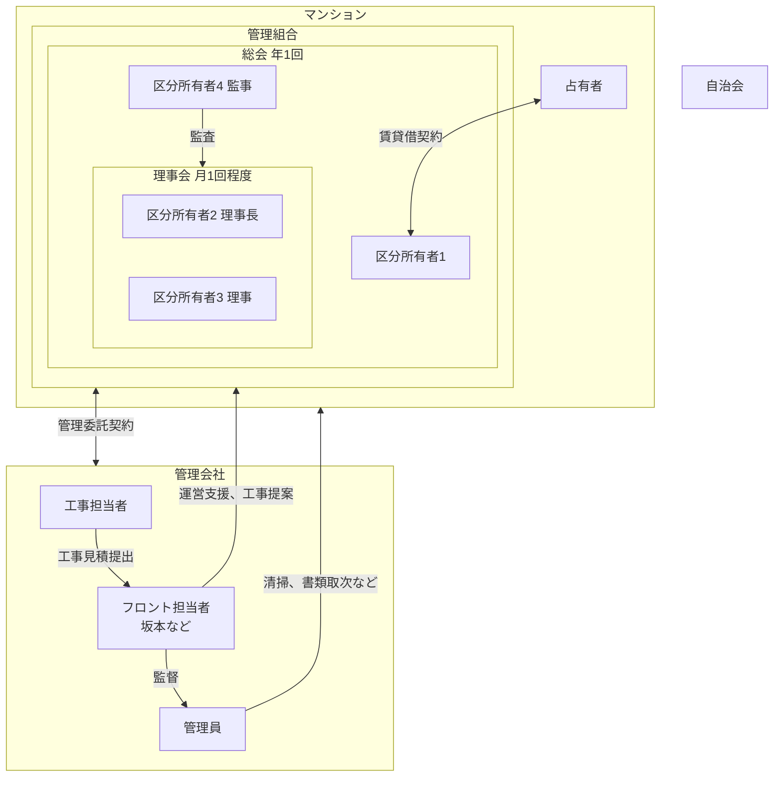

```mermaid

flowchart TD;
subgraph ms[マンション]
    subgraph kk[管理組合]
        subgraph sk[総会 年1回]
            subgraph rj[理事会 月1回程度]
                on2[区分所有者2 理事長]
                on3[区分所有者3 理事]
            end
            on4[区分所有者4 監事]
            on1[区分所有者1]
        end
    end
    se[占有者]
end

subgraph dln[管理会社]
    kj[工事担当者];
    lc[フロント担当者<br>坂本など];
    fm[管理員];
end

自治会

kk<--管理委託契約-->dln;
se<--賃貸借契約-->on1;
lc--監督-->fm;
lc--運営支援、工事提案-->kk;
kj--工事見積提出-->lc;
fm--清掃、書類取次など-->ms;
on4--監査-->rj;

```
