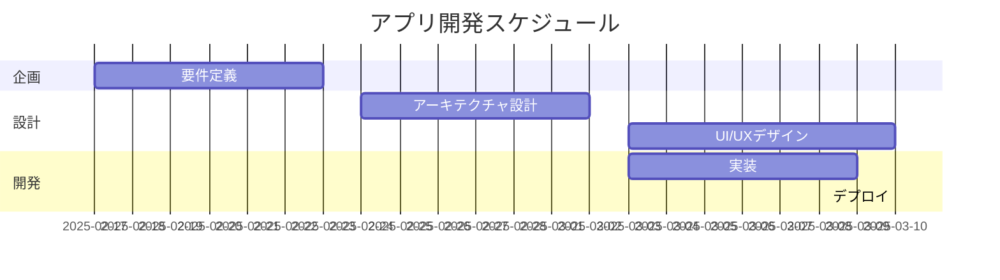

# 実装する機能

## 最もコアな機能

- 居住者から問い合わせを受け取る機能
- 問い合わせを AI で分類わけする機能
- 回答を AI で生成する機能
- 回答する機能
- 回答履歴を整理して表示する機能
- 回答できない場合は担当者へ取り次ぐ機能
- 区分所有法を解釈する機能

## 2 番目に重要な機能

- ログイン、ログアウト　 laravel の機能を利用
- 居住者アカウント laravel の機能を利用
- 管理規約を保存する機能
- 管理規約を解釈する機能



# 画面遷移図


# DB 設計

```mermaid
erDiagram
    居住者 {
        int id
        string name
        string email
        string password
        string address
        string tel
        string created_at
        string updated_at
    }
    問い合わせ {
        int id
        string title
        string body
        int user_id
        string created_at
        string updated_at
    }
    回答 {
        int id
        string title
        string body
        int user_id
        int inquiry_id
        string created_at
        string updated_at
    }
    管理規約 {
        int id
        string title
        string body
        string created_at
        string updated_at
    }
    居住者 ||--o 問い合わせ : "1" *-- "多"
    問い合わせ ||--o 回答 : "1" *-- "多"
    管理規約 ||--o 居住者 : "1" *-- "多"
```
