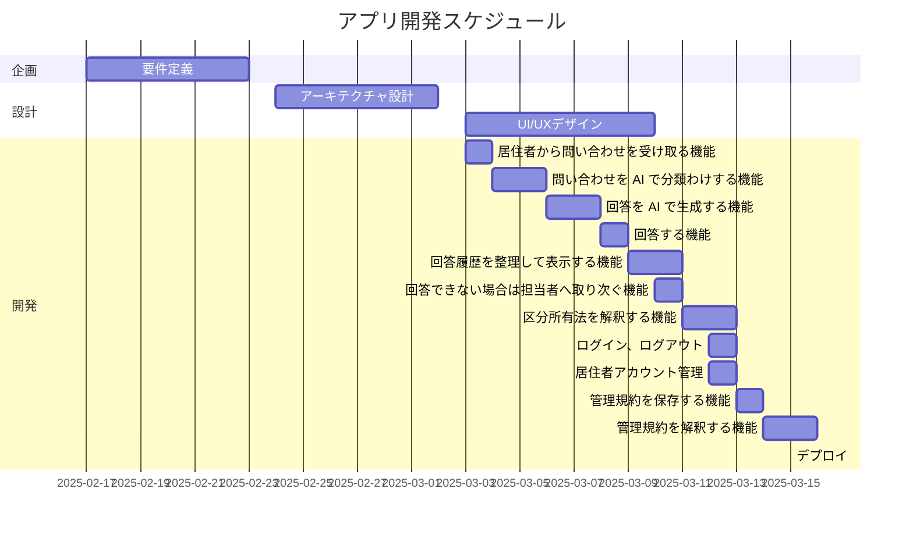

# 実装する機能

## 最もコアな機能

- 居住者から問い合わせを受け取る機能 (8 時間)
- 問い合わせを AI で分類わけする機能 (16 時間)
- 回答を AI で生成する機能 (16 時間)
- 回答する機能 (8 時間)
- 回答履歴を整理して表示する機能 (12 時間)
- 回答できない場合は担当者へ取り次ぐ機能 (8 時間)
- 区分所有法を解釈する機能 (12 時間)

## 2 番目に重要な機能

- ログイン、ログアウト (Laravel の機能を利用) (4 時間)
- 居住者アカウント管理 (Laravel の機能を利用) (4 時間)
- 管理規約を保存する機能 (8 時間)
- 管理規約を解釈する機能 (12 時間)



# 画面遷移図

# DB 設計

```mermaid
erDiagram
    users ||--o{ inquiries : "1-多"
    inquiries ||--o{ responses : "1-多"
    users ||--o{ responses : "1-多"
    regulations ||--o{ users : "1-多"

    users {
        int id PK
        string name
        string email UNIQUE
        string password
        string address
        string tel
        string created_at
        string updated_at
    }

    inquiries {
        int id PK
        string title
        string body
        int user_id FK
        string created_at
        string updated_at
    }

    responses {
        int id PK
        string title
        string body
        int user_id FK
        int inquiry_id FK
        string created_at
        string updated_at
    }

    regulations {
        int id PK
        string title
        string body
        string created_at
        string updated_at
    }
```
